# DentalSys 2.0 — Manual do Usuário

Sistema de gestão para consultórios odontológicos. Este manual apresenta, módulo a módulo, o passo a passo de uso das funcionalidades.

---

## Sumário

1. [Acesso ao sistema](#1-acesso-ao-sistema)
2. [Painel (Dashboard)](#2-painel-dashboard)
3. [Pacientes](#3-pacientes)
4. [Ficha do paciente](#4-ficha-do-paciente)
5. [Agenda](#5-agenda)
6. [Financeiro](#6-financeiro)
7. [Fechamento de Caixa](#7-fechamento-de-caixa)
8. [Cobrança Online (Pix, Boleto e Cartão)](#8-cobrança-online)
9. [Mensagens](#9-mensagens)
10. [Notas Fiscais](#10-notas-fiscais)
11. [Relatórios](#11-relatórios)
12. [Cadastros](#12-cadastros)
13. [Configurações da Clínica](#13-configurações-da-clínica)
14. [Usuários e Permissões](#14-usuários-e-permissões)
15. [Regras por cargo de usuário](#15-regras-por-cargo-de-usuário)

---

## 1. Acesso ao sistema

1. Abra o navegador e acesse o endereço do sistema (ex.: `http://localhost:5173`).
2. Informe seu **e-mail** e **senha** e clique em **Entrar**.
3. Ao entrar, o sistema abre automaticamente o **Painel** com as principais informações do dia.

> Usuário de demonstração: `admin@dentalsys.com` / senha `admin123`.

---

## 2. Painel (Dashboard)

É a tela inicial. Divide-se em duas partes principais.

### 2.1 Informações do dia (bloco "Hoje")
Ao abrir o sistema, o painel destaca:

- **Atendimentos do dia** — total, realizados, faltas e taxa de comparecimento.
- **Próximo atendimento** — horário, paciente, profissional e procedimento.
- **Lista de próximos atendimentos de hoje** — clique no nome do paciente para abrir o cadastro.
- **Financeiro do dia** — recebido hoje, a receber hoje e despesas de hoje.
- **Status do caixa** — mostra se o caixa já foi aberto/fechado, com acesso ao Fechamento de Caixa.

### 2.2 Informações do mês
- **Cards:** pacientes ativos, pacientes novos, atendimentos realizados/taxa, agendados próximos e confirmações pendentes.
- **Financeiro do período:** recebido, a receber e despesas.
- **Avisos:** aniversariantes dos próximos 7 dias, retornos atrasados e vencimentos dos próximos 7 dias.
- **Ranking de profissionais** mais ativos no período.
- **Atalhos:** "+ Novo agendamento", "+ Novo paciente" e "+ Novo lançamento".

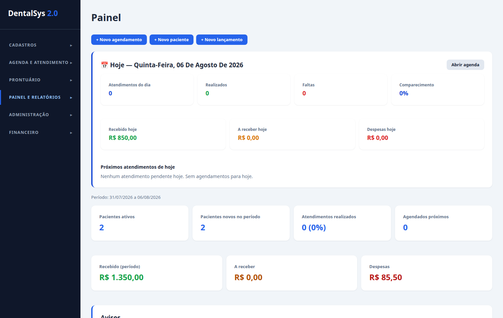
---

## 3. Pacientes

**Passo a passo: cadastrar (criar paciente):**
1. No menu lateral, clique em **Pacientes**.
2. Clique em **+ Novo paciente**.
3. Preencha os campos (o único obrigatório é o **Nome completo**). Use o **CEP** + botão **Buscar** para preencher o endereço automaticamente (ViaCEP).
4. Clique em **Salvar**.

**Importar de planilha (CSV):**
- Clique em **Importar CSV**, selecione o arquivo `.csv` e confira o resumo (importados, duplicados por CPF, erros).

**Exportar:**
- Clique em **Exportar CSV** para baixar a lista de pacientes.

**Buscar:**
- Use o campo "Buscar por nome, CPF ou telefone...".

**Ações na lista:** clique na linha do paciente para abrir a ficha completa; o botão **Excluir** remove o cadastro (somente admin).

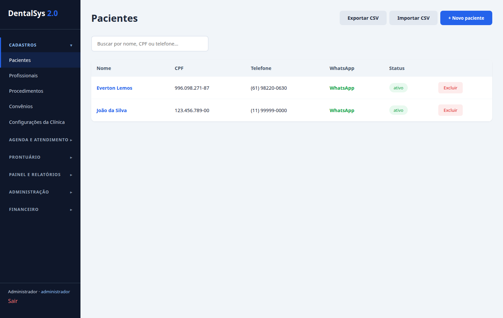
---

## 4. Ficha do Paciente

Abra clicando em um paciente na lista de Pacientes. A ficha tem abas:

- **Dados Gerais** — nome, CPF, nascimento, RG, convênio e status.
- **Contato** — telefone, WhatsApp, e-mail, endereço/CEP.
- **Anamnese** — alergias, indicação e observações.
- **Prontuário** — registro clínico (odontograma, evoluções, exames, receituários e **Termos de Consentimento**).
- **Financeiro** — lançamentos do paciente.
- **Retornos** — atendimentos realizados.

**Para editar:** clique em **Editar**, altere o que precisar na aba desejada e clique em **Salvar alterações**.

**Termos de Consentimento:** dentro do prontuário, crie o termo (título e conteúdo) e use **Assinar** para registrar a assinatura com data.

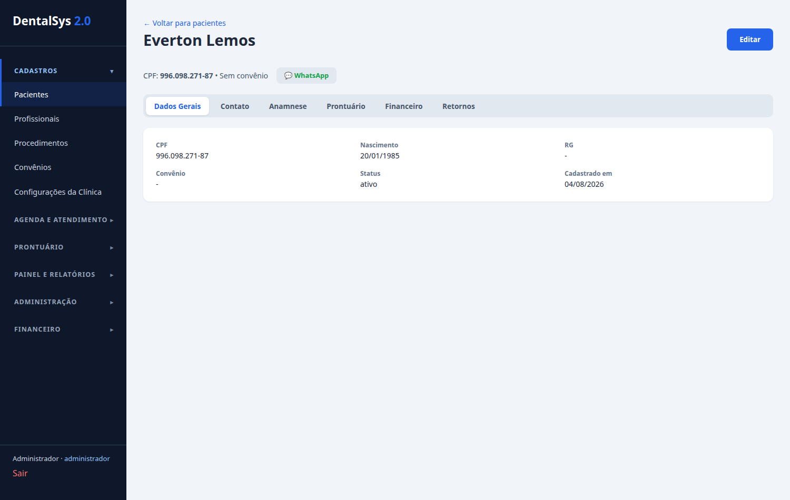
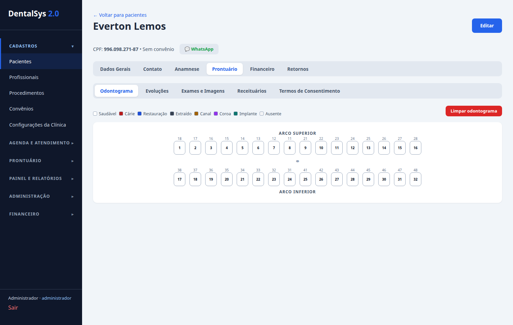
---

## 5. Agenda

Apresenta os atendimentos por **Dia**, **Semana**, **Mês** ou **Histórico**.

**Novo agendamento:**
1. Clique em **+ Novo agendamento** (ou clique em um horário livre na grade).
2. Selecione **Paciente** (busca) e **Profissional** (obrigatórios).
3. Opcionalmente escolha **Sala**, **Procedimento** e defina **Data**, **Hora** e **Duração**.
4. Clique em **Agendar**.

**Ações no agendamento** (clique no evento para abrir os detalhes):
- **Confirmar** — muda status para Confirmado.
- **Confirmar (enviar)** — envia confirmação por WhatsApp e marca como confirmado.
- **Atender** — inicia/registra o atendimento realizado.
- **Faltou** — registra a falta.
- **Reagendar** — reativa um atendimento que faltou.
- **Cancelar** — cancela (não ocupa mais a agenda).
- **Marcar retorno** — após o atendimento, agenda um retorno.
- **Editar / Excluir** — altera ou remove o agendamento.

**Bloquear horário:** clique em **🔒 Bloquear horário**, informe profissional, sala, data/hora, duração e o motivo.

**Filtros:** use "Todas as salas" e "Todos os profissionais". No **Histórico**, busque por paciente e veja os atendimentos já realizados/faltas.

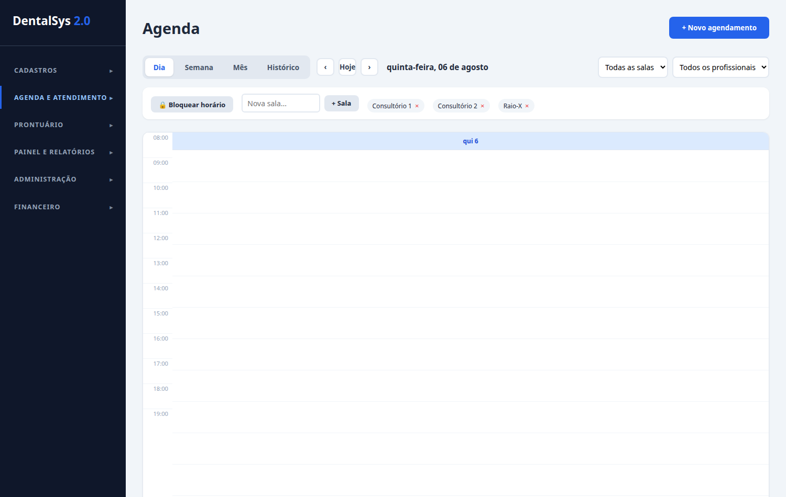
---

## 6. Financeiro

Abas: **Lançamentos**, **Comissões** e **Fechamento de Caixa**.

**Criar lançamento:**
1. Clique em **+ Novo lançamento**.
2. Escolha o **Tipo** (Receita ou Despesa) e informe **Descrição**.
3. Preencha o **Valor bruto** e, se houver, o **Desconto** e a quantidade de **Parcelas** (até 12x, o sistema calcula o valor líquido e de cada parcela).
4. Selecione a **forma de pagamento** (Dinheiro, Pix, Cartão, Convênio, Transferência) e o **vencimento da 1ª parcela**.
5. Selecione **Paciente**, **Procedimento** (preenche valor/descrição) e **Profissional** (gera comissão automaticamente).
6. Clique em **Salvar**.

**Receber (baixar):**
- Na linha de um lançamento pendente, clique em **Receber** para registrar o pagamento.

**Cobrança (gateway):**
- Na linha de uma receita pendente, clique em **Cobrança** para gerar Pix, Boleto ou Cartão (ver [seção 8](#8-cobrança-online-pix-boleto-e-cartão)).

**Cancelar / Excluir:**
- Use **Cancelar** (dançamento pendente) e **Excluir** (nunção: remoção definitiva de lançamento não pago).

**Comissões:**
- Veja as comissões geradas automaticamente por profissional (percentual configurado). Clique em **Marcar como paga** quando pagar.

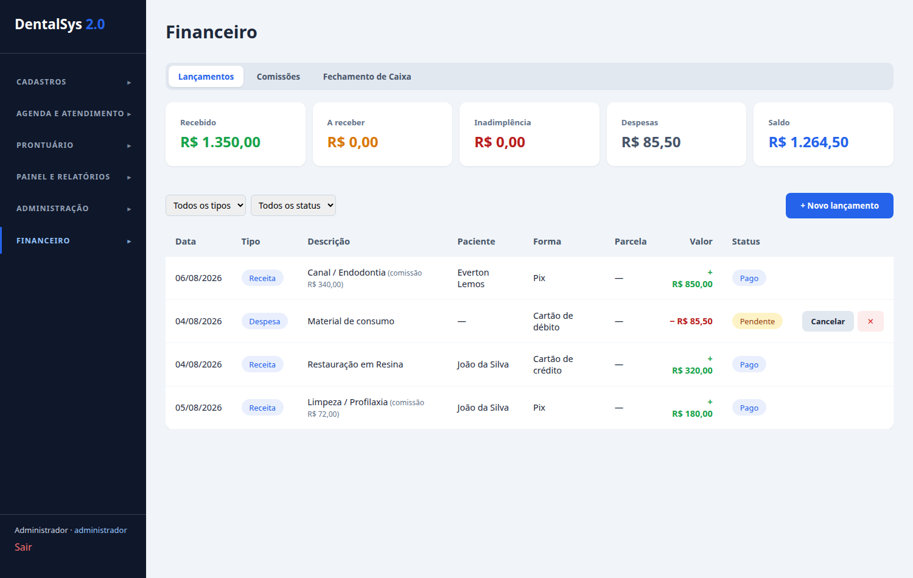
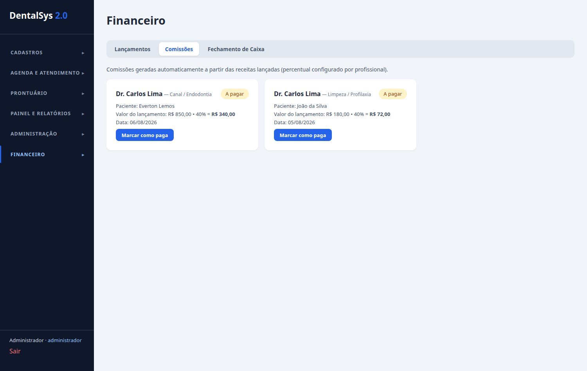
---

## 7. Fechamento de Caixa

Na aba **Fechamento de Caixa** (acesso do administrador):

**Abrir o caixa:**
1. Informe o **Dinheiro inicial** e, opcionalmente, observações da abertura.
2. Clique em **Abrir caixa**.

**Durante o dia:**
- O sistema mostra automaticamente as **receitas**, **despesas**, **total em caixa esperado** e o resumo **por forma de pagamento** (dinheiro, Pix, cartão etc.).

**Fechar o caixa:**
1. Informe o **Valor contado em caixa** (o que realmente há no físico).
2. Clique em **Fechar caixa**.
3. O sistema calcula e mostra a **Divergência** (diferença entre o contado e o esperado).

**Histórico:** a tab**a "Histórico de fechamentos"** lista todos os fechamentos com data, totais, divergência e responsável.

> O caixa só pode ser aberto/fechado pelo **administrador**. Um dia só pode ser fechado uma vez.

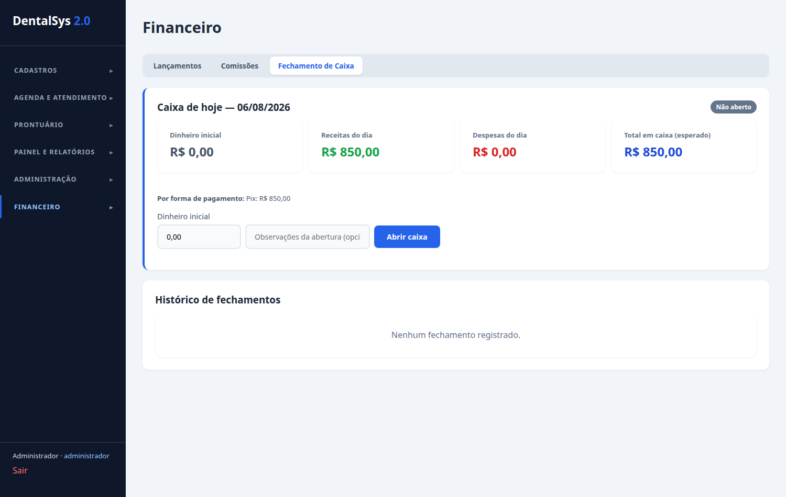
---

## 8. Cobrança Online (Pix, Boleto e Cartão)

Gerada pelo botão **Cobrança** em um lançamento de receita pendente.

**Passo a passo:**
1. Abra o modal de cobrança (o valor vem do lançamento).
2. Escolha a forma: **Pix**, **Boleto** ou **Cartão**.

**Pix:**
- É exibido o **QR Code** e o código **Pix copia e cola**; use **Copiar** para enviar ao cliente.

**Boleto:**
- Veja a **Linha digitável** (use **Copiar**) e o link **Abrir boleto**.

**Cartão:**
- Preencha **Nome impresso no cartão**, **Número**, **Validade (MM/AAAA)**, **CVV** e escolha as **Parcelas**.
- Clique em **Gerar cobrança**. Se aprovado, o lançamento é baixado automaticamente (aparece "Pagamento aprovado").

**Modo de operação:**
- Sem credenciais do gateway configuradas, a cobrança é gerada em **modo simulação** (com aviso visual). Ao configurar as credenciais reais em Configurações → Gateway de pagamento, as cobranças passam a ser reais.
- Para cobrança não confirmada na hora (Pix/Boleto), use **Marcar como pago** quando o pagamento for confirmado.

**Webhook (receber confirmação automática):**
- Se configurado em Configurações, o servidor recebe a confirmação do gateway automaticamente e baixa o lançamento. (Sujeito à configuração de **Webhook Secret** e **IP permitido**.)

---

## 9. Mensagens

Abas: **Confirmações pendentes**, **Modelos de mensagens** e **Envio automático**.

**Enviar confirmação:**
- Na aba Confirmações pendentes, veja os atendimentos futuros sem confirmação enviada.
- Clique em **Enviar confirmação** (envia via WhatsApp se configurado e marca como confirmado).

**Modelos de mensagens:**
- Selecione o tipo (Confirmação, Lembrete, Retorno, Aniversário).
- Edite o **Texto do modelo** usando os **marcadores** `{{paciente}}`, `{{data}}`, `{{hora}}`, `{{profissional}}`, `{{procedimento}}`, `{{clinica}}`.
- Marque **Modelo ativo** para que seja usado nos envios automáticos.
- Clique em **Salvar modelo**.

**Envio automático:**
- Configure a **Antecedência do lembrete** (1h a 7 dias antes) e os tipos de envio (lembrete, retorno atrasado, aniversário).
- Clique em **Salvar configuração**.
- Use **Disparar agora** para executar um disparo imediato e ver o resumo.
- Acompanhe o **Histórico de envios** (filtrado por tipo), com status de envio.

> Para envio real de WhatsApp é preciso configurar o provedor (variável de ambiente `WHATSAPP_API_URL`). Sem isso, os envios ficam marcados como **simulados**.

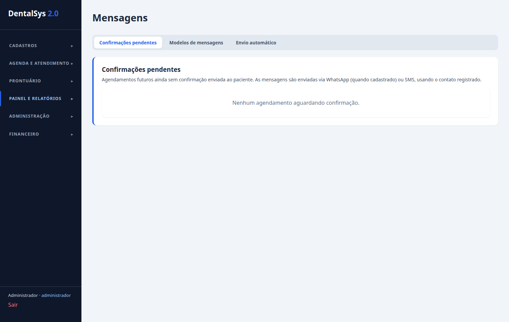
---

## 10. Notas Fiscais

**Nova nota fiscal:**
1. Clique em **+ Nova nota fiscal**.
2. Escolha o **Paciente**, o **Tipo** (serviço/produto) e informe **Valor**, **Descrição** e dados fiscais (código de serviço, alíquota, emissor).
3. Clique em **Salvar nota**.
4. Para enviar, clique em **Emitir**. Acompanhe o **Status** (Rascunho, Lote enviado, Autorizada, Rejeitada, Cancelada).

**Integrações e emissor próprio:**
- Em **Integrações**, configure o provedor de emissão (Emissor próprio, Tiny ou Bling) com tokens/credenciais e os dados municipais (IBGE, inscrição municipal, endpoints, certificado).

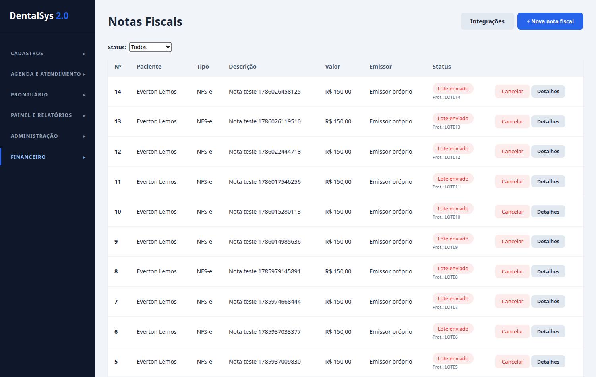
---

## 11. Relatórios

Abas: **Atendimentos**, **Pacientes**, **Financeiro** e **Análises** (a aba Financeiro só para quem vê financeiro). Todas têm filtro de período (**De** e **Até**).

- **Exportar CSV** e **Imprimir PDF** em cada aba.
- **Atendimentos:** relação de atendimentos com status/paciente/profissional.
- **Pacientes:** cadastros ativos.
- **Financeiro:** recebido, a receber, despesas e a lista de lançamentos.
- **Análises:** taxas de atendimento, procedimentos mais realizados, faturamento por profissional, comissões pendentes e retornos atrasados.

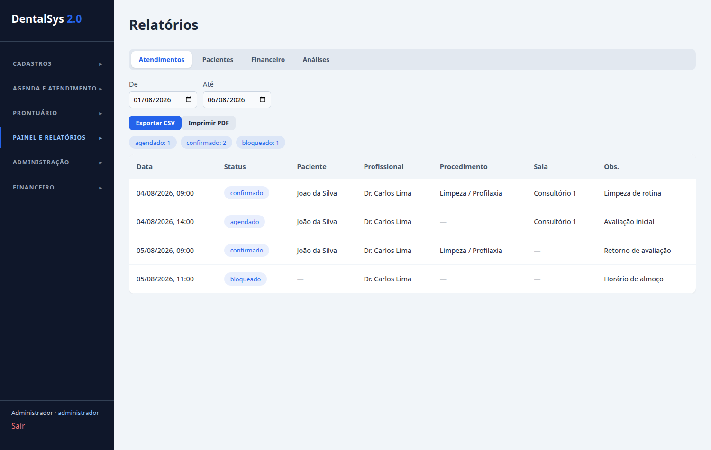
---

## 12. Cadastros

**Profissionais/Colaboradores (**+ Novo profissional**):**
- Nome, CRO, especialidade, horário, **comissão (%)**, cargo e e-mail de acesso.
- Últimos dos procedimentos, o percentual gera comissão automaticamente nos lançamentos.

**Procedimentos (**+ Novo procedimento**):**
- Nome, código TUSS, valor particular e duração média.
- Na tabela, defina o **valor por convênio** (edite a célula no convênio).

**Convênios (**+ Novo convênio**):**
- Nome, registro (ANS) e telefone.

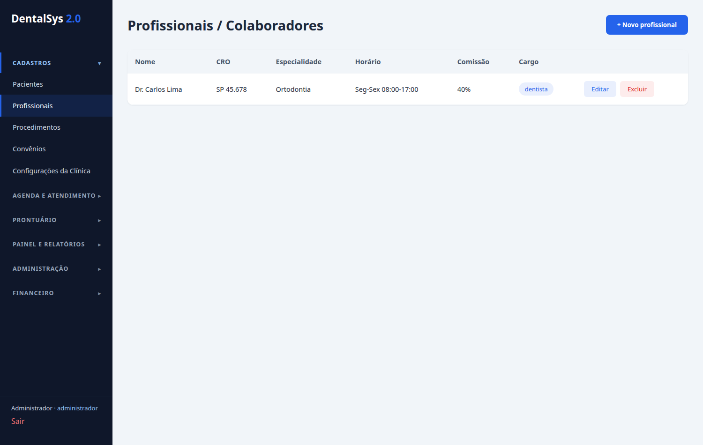
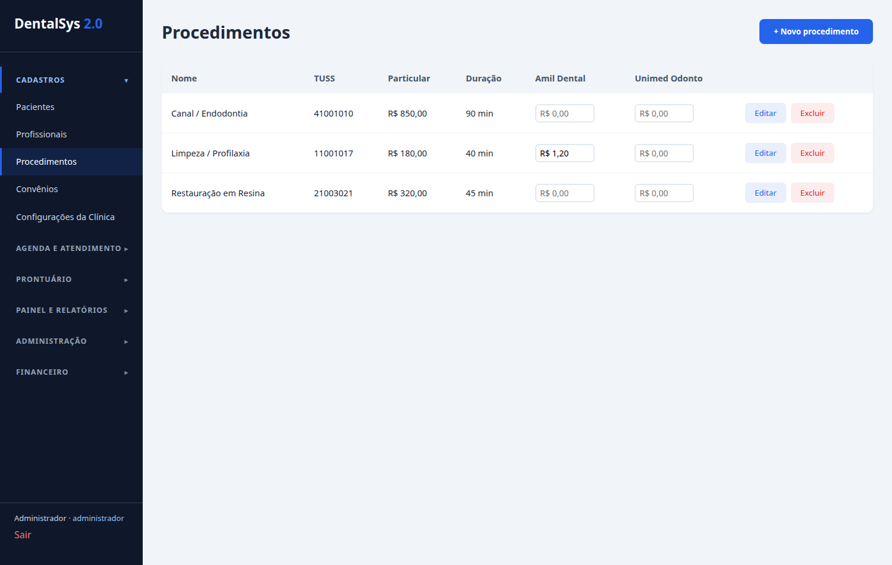
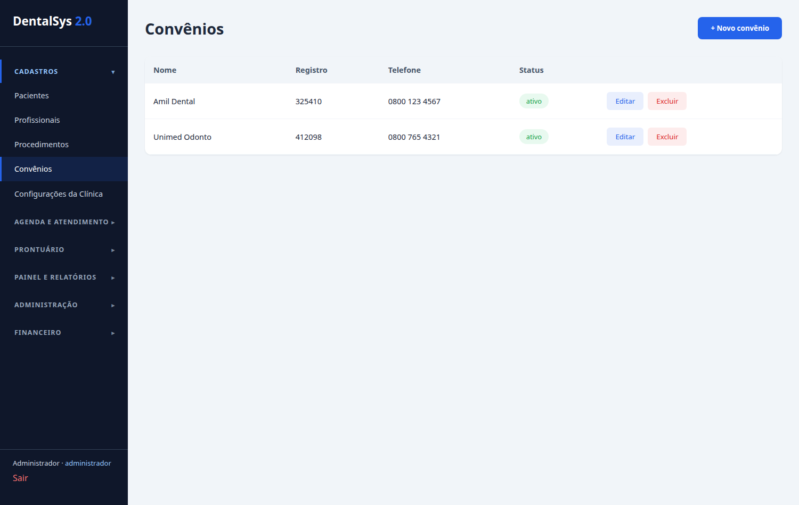
---

## 13. Configurações da Clínica

- **Dados gerais:** nome fantasia, razão social, CNPJ, responsável, contato/endereço.
- **Gateway de pagamento:**
  - **Ambiente** (Sandbox/Produção), **Client ID**, **Client Secret**, **Chave Pix**.
  - **Webhook Secret** e **IP permitido** (para a confirmação automática de pagamentos).
  - **Ativar gateway** para usar credenciais reais (sem ativa, tudo fica em modo simulação).
- Apenas o **administrador** (`config.editar`) pode salvar essas configurações.

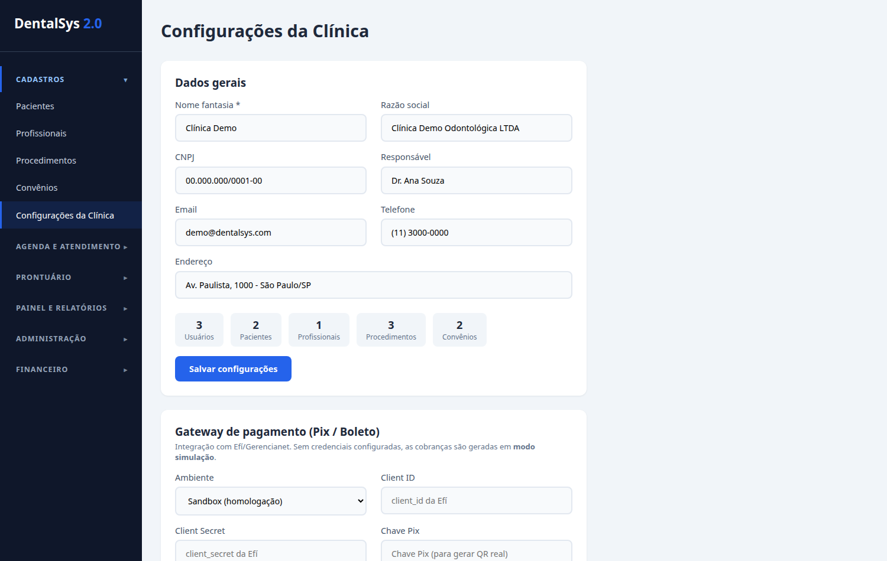
---

## 14. Usuários e Permissões

Em **Usuários** (menu Administração, somente admin) crie os acessos ao sistema:

1. Clique em **+ Novo usuário**.
2. Informe **Nome**, **e-mail**, **senha** e o **Cargo** (Administrador, Dentista ou Recepcionista).
3. Clique em **Cadastrar**.
4. Para alterar, use **Editar**; para tirar o acesso,use **Desativar**/**Ativar**.

Cada cargo já vem com permissões pré-definidas (ver se seção 15).

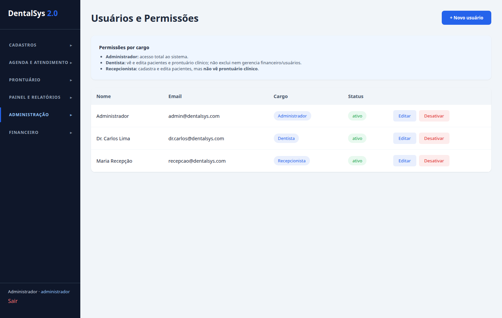
---

## 15. Regras por cargo de usuário

| Área | 👑 Administrador | 🦷 Dentista | 🛎️ Recepcionista |
|---|---|---|---|
| **Pacientes** | cria, edita, exclui, importa/exporta | vê e edita (não exclui) | cria e edita (não exclui) |
| **Prontuário** | vê e edita | vê e edita (registro clínico) | não vê |
| **Profissionais / Procedimentos / Convênios** | total | somente leitura | somente leitura |
| **Agenda** | completa (criar/editar/excluir/atender/bloquear) | cria, edita, atende | cria, edita, atende |
| **Financeiro** | total (inclui caixa e comissões) | somente leitura | vê, cria e baixa pagamento (sem caixa) |
| **Configurações / Mensagens** | total | sem acesso | sem acesso |
| **Usuários** | gerencia | sem acesso | sem acesso |
| **Fechamento de Caixa** | abre e fecha | — | não pode |

---

*Fim do manual. Em caso de dúvidas, consulte o administrador do sistema.*